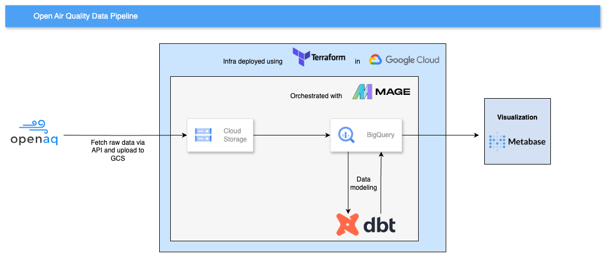
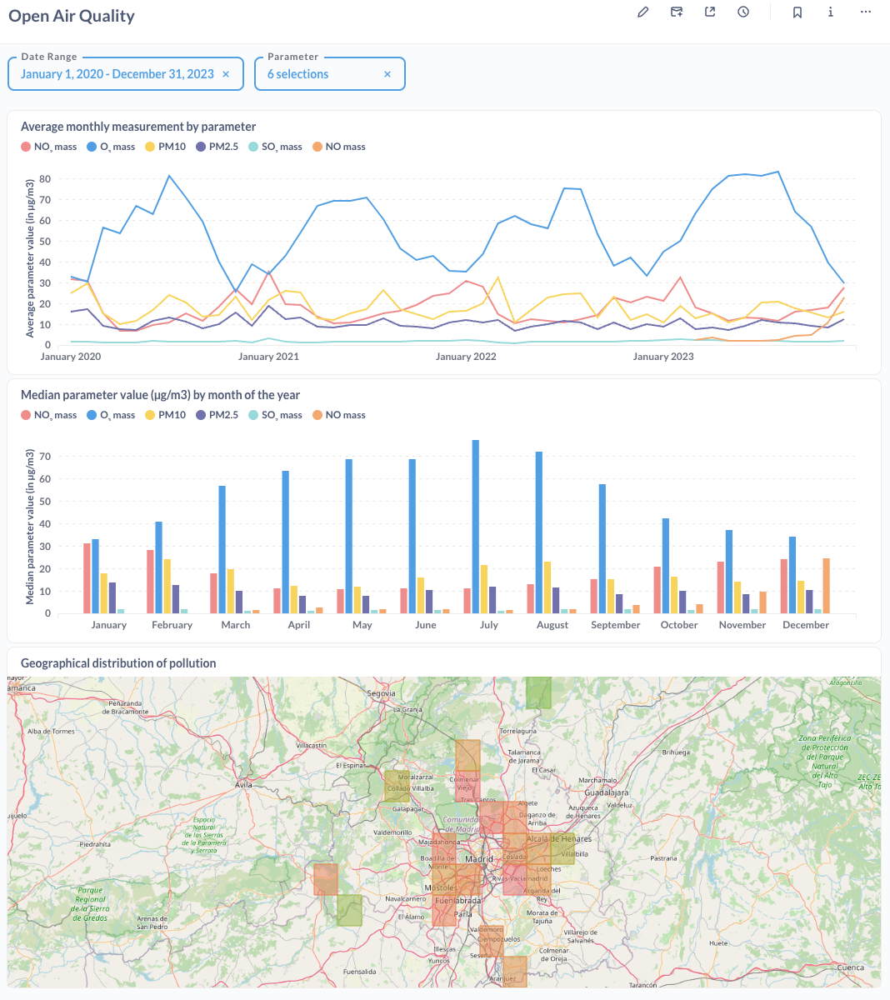

# Open Air Quality Data Pipeline

  
Welcome to the Open Air Quality project! This project focuses on creating a data pipeline to explore air quality data in Madrid, Spain. It is the capstone project of the [Data Engineering Zoomcamp](https://github.com/DataTalksClub/data-engineering-zoomcamp) course.

## Overview
This project consists of an ETL (extraction, loading and transforming) data pipeline from an API to Google BigQuery, also storing the data in Google Cloud Storage (GCS). The data in BigQuery is modeled using DBT (Data Build Tool), and is then visualised using Metabase.

## Problem statement
Despite efforts to monitor and regulate air quality in Madrid, there remains a significant challenge in accurately predicting and mitigating pollution hotspots. This project aims to leverage data from the Open Air Quality initiative to develop a comprehensive understanding of the spatial and temporal distribution of air pollutants in Madrid.
To conduct appropriate data analysis, an analytics platform with reliable, consistent, and structured data is needed. To provide such data infrastructure and flow is the objective of this project.

## The dataset
The Open Air Quality project is an initiative focused on monitoring and improving air quality. It involves the deployment of sensors in various locations to collect data on pollutants such as particulate matter, ozone, nitrogen dioxide, and sulfur dioxide. This data is then analyzed to understand patterns, identify sources of pollution, and develop strategies to address air quality issues. Open Air Quality projects are often community-driven, involving collaboration between citizens, scientists, and policymakers to raise awareness and take action to improve air quality in their local areas.

The dataset used is extracted directly from the official Open Air Quality API, and it contains air quality meaurements data spanning from 2019 to 2024 from Madrid, Spain. Each measurement is linked to an air quality sensor via coordinates, and is provided with information about the pollutant it measures. More information can be found in the [API documentation](https://docs.openaq.org/docs/getting-started).

## The project 
### Technologies Used

- **Data processing language**: Python
- **Cloud**: Google Cloud Platform (GCP)
- **Infrastructure as Code (IaC)**: Terraform
- **Containerization**: Docker
- **Workflow Orchestration**: Mage
- **Data Lake**: GCS (Google Cloud Storage)
- **Data Warehouse**: BigQuery
- **Data Transformation**: DBT (Data Build Tool)
- **Business Intelligence**: Metabase

### Workflow
1. **Cloud Infrastructure Deployment**: The project commences by orchestrating the requisite infrastructure setup via Terraform's Infrastructure as Code (IaC) solution. This ensures a streamlined and reproducible deployment process, facilitating version control, scalability and manageability.

2. **Data Extraction and Loading to GCS**: This phase involves acquiring the data from the Open Air Quality API, followed by necessary processing. The data is then converted from JSON to Parquet, a format that optimizes storage efficiency, and enablies seamless ingestion into Google Cloud Storage (GCS).

3. **Data Ingestion into BigQuery**: Subsequently, the data housed within GCS is ingested into BigQuery, a data warehousing solution. This allows the data to be queried and analised. Furthermore, data is organised in tables optimised for fast and optimal retrieval.

4. **Data Modeling with DBT**: Leveraging DBT (Data Build Tool), comprehensive data transformation and modeling was made. This involves tasks such as data cleansing, removing sparse entries, and applying business logic to refine the dataset for analysis.

5. **Data Visualization with Metabase**: Finally, the transformed data in BigQuery is visualized using Metabase. This platform seamlessly integrates with BigQuery, allowing stakeholders to derive actionable insights through intuitive data exploration and reporting capabilities.

This flow can be better visualised with a diagram:



### Data visualization
The final output, a dashboard, is created using Metabase, an open-source business intelligence tool that can be connected to many popular databases. The dashboard allows interactive exploration of the geographical distribution of pollutants, the evolution of such pollutants through time, and other trends. 



## Project Reproducibility

To use this project, the first step is to fork and/or clone this repository to your machine.

### GCP set up and Service Account credentials
1. Go to [GCP Website](https://cloud.google.com/) and create an account.
2. Go to [Google Cloud Console](https://console.cloud.google.com/) and create a new project.
3. Navigate to IAM & Admin > Service Accounts.
4. Create a Service Account, and add the following roles to it:
- roles/storage.Admin: This role grants full administrative access to Cloud Storage buckets, allowing Terraform to create, delete, and modify them.
- roles/bigquery.DataEditor: This role allows creating, updating, and deleting datasets and tables in BigQuery. Terraform requires this role to manage BigQuery resources like creating datasets and tables or deleting them.
- roles/BigQuery Job User: This role allows submitting BigQuery Jobs.
5. Generate a key: after creating the account, click "Create Key" and choose JSON format.
6. Download the credentials in JSON format and save it to the project directory root with the name "google_credentials.json".

### Open Air Quality API key
1. Register on openaq's [website](https://explore.openaq.org/register).
2. Go to your account, and generate an API key.

### Env variables
1. Delete the "-example" suffix of the .env file, and fill in the variables:
- OPENAQ_API_KEY: The API key you generated in the previous step.
- GCP_CREDENTIALS: The path is already filled in.
- GCP_PROJECT_ID: Id of the GCP project you just initialised.
2. Navigate to the "terraform" folder, delete the "-example" suffix from terraform.tfvars, and fill in the variable:
- project_id: Id of the GCP project you just initialised.

### Environment prerequisites
- [Terraform](https://developer.hashicorp.com/terraform/install)
- [Docker with Docker-Compose](https://www.docker.com/products/docker-desktop/)

### Deploying infrastructure
Access the "terraform" directory, and execute the following commands in the terminal:

```bash
cd terraform
terraform init
terraform plan
terraform apply
```
When prompted to deploy the infrastructure, write 'yes' and press Enter. The deployment might take up to 10 minutes.

### Running the pipeline
Return to the root directory of the project, and execute the docker-compose file with:

```bash
docker-compose up -d
```

This will spin up a container with a mage.ai image and the pipelines in it. The pipelines are scheduled to run monthly. However, to manually run the pipelines, run the following command:

```bash
docker exec -it ecoenergy_de /bin/bash
```

This will allow you to run commands inside the Docker image. Once inside, navigate inside the mage project folder with:

```bash
cd mage-dbt
```

And then run the following python script. This may take a while to run.

```bash
python run_pipelines.py
```

A more user-friendly option is to access Mage's UI in localhost via the port 6789 ([url](http://localhost:6789/)), and run the pipeline manually. You can find more information [here](https://docs.mage.ai/design/data-pipeline-management).

Once completed, you will have raw and transformed data in cloud storage and BigQuery. The only step remaining is to create the dashboard. Unfortunately, this is not entirely reproducible, but let's see how to set up Metabase.

### Initialise Metabase
The easiest way to launch Metabase is by using Docker. First, we need to pull the image from DockerHub:

```bash
docker pull metabase/metabase:latest
```

Then, we will intialise a container with that image, that will forward its interface to port 3000 (by default):
```bash
docker run -d -p 3000:3000 --name metabase metabase/metabase
```

Metabase will be available at localhost:3000. Once there, follow the account creation steps, and connect to BigQuery with the service account credential file. You can generate a dashboard with the tables you just created!

## Next steps
- Implementing real-time data processing.
- Deploying Mage to a cloud run instance.
- Adding CI/CD flows to Mage.
- Implementing tests in DBT.

Any other ideas, comments, or suggestions are more than welcome. You may contact me on [Linkedin](https://www.linkedin.com/in/marc-soler/).

## License

This project is licensed under the [Apache License](./LICENSE).